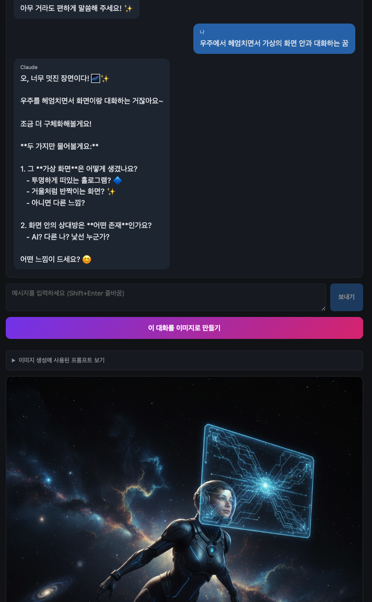

# Vibe Code Sample — Claude × Gemini Image

Claude API로 대화를 진행하고, "이미지로 만들기" 버튼을 누르면 그 대화를 Gemini 2.5 Flash Image로 한 장면의 이미지로 그려주는 Next.js 샘플 프로젝트.

바이브코딩(Vibe Coding) 입문자가 **AI 에디터(Claude Code, Cursor 등)에게 무엇을, 어떻게 지시해야 잘 동작하는 결과물이 나오는지** 익히기 위한 레퍼런스로 만들어졌다.

<p align="center">
  
</p>

---

## 1. 빠른 시작

```bash
# 1) 의존성 설치
npm install

# 2) API 키 등록 — .env.example 복사 후 값 채워넣기
cp .env.example .env.local
#   ANTHROPIC_API_KEY=sk-ant-...   (https://console.anthropic.com/)
#   GEMINI_API_KEY=AIza...         (https://aistudio.google.com/apikey)

# 3) 실행
npm run dev
# → http://localhost:3000
```

> 모델은 `gemini-2.5-flash-image`. AI Studio 무료 키로도 동작한다.

---

## 2. 프로젝트 구조

```
app/
  layout.tsx              # 루트 레이아웃
  page.tsx                # 채팅 UI + 이미지 생성 버튼
  globals.css             # 공통 스타일
  api/
    chat/route.ts         # Claude 대화 (claude-sonnet-4-6)
    image/route.ts        # 대화 → 영문 프롬프트 → Gemini 2.5 Flash Image
.env.example              # 키 템플릿
```

**핵심 흐름**

1. 사용자가 채팅 → `/api/chat` → Claude가 답변
2. "이미지로 만들기" 클릭 → `/api/image`
   - Claude가 전체 대화를 읽고 **영문 image prompt** 한 줄 생성
   - 그 프롬프트를 Gemini 2.5 Flash Image에 넘겨 base64 PNG 반환
3. 결과 이미지와 사용된 프롬프트를 화면에 표시

---

## 3. 바이브코딩 프롬프트 잘 쓰는 법

> "AI한테 막연히 시키면 막연한 게 나온다." 바이브코딩의 실력은 결국 **요구사항을 얼마나 구체적이고 검증 가능하게 전달하는가**에 달려있다.

### 3-1. 좋은 프롬프트의 4가지 축

| 축 | 질문 | 예시 |
|---|---|---|
| **목적(What)** | 뭘 만들고 싶은가? | "Claude와 대화하는 채팅 UI" |
| **맥락(Why)** | 어디에 쓰는가? 누가 보는가? | "타인에게 보여줄 데모용, 로컬에서만 돌아가면 됨" |
| **제약(Constraints)** | 스택, 의존성, 환경, 마감 | "Next.js, TypeScript, 외부 DB 없이, 1시간 안에" |
| **완료 조건(Definition of Done)** | 어떻게 되면 끝인가? | "메시지 보내면 답 오고, 버튼 누르면 이미지가 화면에 뜬다" |

이 네 가지 중 하나라도 빠지면 AI가 추측으로 메꾸기 시작하고, 그 추측이 틀리면 다시 작업해야 한다.

### 3-2. 나쁜 예 vs 좋은 예

**나쁜 예** (모호함)
```
Claude로 챗봇 만들어줘
```

**좋은 예** (구체적)
```
Next.js 15 App Router + TypeScript로 채팅 페이지를 만들어줘.
- API 라우트(/api/chat)에서 @anthropic-ai/sdk로 Claude를 호출
- 모델은 claude-sonnet-4-6
- 시스템 프롬프트는 "사용자가 한 장면을 상상하도록 돕는 파트너"
- 메시지는 클라이언트 상태로만 관리(DB 없음)
- 입력창은 Enter=전송, Shift+Enter=줄바꿈
- 키는 .env.local의 ANTHROPIC_API_KEY로 읽기
```

### 3-3. 작업을 쪼개라 (분할 정복)

큰 요청 한 방보다 작은 요청을 순서대로 주는 게 훨씬 안정적이다.

```
1) 먼저 빈 Next.js 프로젝트 구조만 만들어줘 (package.json, tsconfig, layout)
2) 채팅 UI만 먼저 (mock 답변으로)
3) /api/chat 실제 Claude 연동
4) 이미지 생성 버튼과 /api/image 추가
5) UI 폴리시 — 로딩 상태, 에러 표시
```

각 단계 후에 **실제로 돌려보고**, 문제가 있으면 그 단계에서 고친다.

### 3-4. AI에게 정보를 충분히 줘라

- **에러가 나면 에러 메시지를 그대로** 붙여 넣기. "안 돼요" 금지.
- **현재 파일 내용**을 같이 보여줘야 정확한 수정이 나옴.
- **이전 결정의 이유**를 알려줘야 같은 실수를 안 한다. ("이건 일부러 simple하게 둔 거야")

### 3-5. 검증 가능한 요구사항만 적어라

- 좋음: "버튼 클릭 후 3초 안에 로딩 인디케이터가 뜬다"
- 나쁨: "사용자 경험을 좋게 만들어"

좋은 요구사항은 **그게 됐는지 눈으로 확인할 수 있다**. 안 보이면 디버깅도 못 한다.

### 3-6. 보안 기본기는 처음부터

- API 키는 **절대로 클라이언트 코드(브라우저에 가는 JS)** 에 넣지 않는다. 반드시 서버 라우트에서만 사용.
- `.env.local` 같은 비밀 파일은 처음부터 `.gitignore`에 추가.
- 깃에 한 번 올라간 키는 **반드시 폐기 후 재발급**. 히스토리에서 지운다고 안전해지지 않는다.

### 3-7. 결과를 받고 멈추지 마라

AI가 코드를 줬다고 끝이 아니다.

1. **읽어본다** — 내가 이해 못 한 줄이 있으면 설명을 요청.
2. **돌려본다** — 진짜 동작하는지 확인.
3. **엣지 케이스를 던져본다** — 빈 입력, 긴 입력, 네트워크 끊김.
4. **마음에 안 들면 다시 말한다** — "이 부분은 X 방식으로 바꿔줘".

---

## 4. 이 샘플에서 일부러 한 선택들

학습용이라 **의도적으로 단순하게** 둔 부분들:

- **상태 관리는 useState만** — Zustand, Redux 같은 도구 없이 React 기본만.
- **DB 없음** — 대화는 페이지 새로고침하면 사라진다.
- **인증 없음** — 로컬 데모 가정. 공개 서비스라면 반드시 추가해야 함.
- **스트리밍 없음** — Claude 응답을 한 번에 받는 가장 단순한 형태. 실제로 쓸 거면 streaming으로 바꾸면 체감이 훨씬 좋다.

이런 선택을 그대로 따를 필요는 없다. **"왜 이건 이렇게 했지?" → "이렇게 바꾸려면?"** 으로 AI한테 물어보면서 바꿔보는 게 학습이다.

---

## 5. 자주 만나는 에러

| 증상 | 원인 | 해결 |
|---|---|---|
| `ANTHROPIC_API_KEY가 설정되지 않았습니다` | `.env.local` 미생성 / 변수명 오타 | 파일 확인 후 `npm run dev` 재시작 |
| 이미지 생성에서 403 / quota | 모델 미지원 키 또는 쿼터 초과 | `scripts/list-models.mjs`로 가용 모델 확인 후 모델명 교체 |
| 이미지 생성에서 404 NOT_FOUND | 모델명이 키에서 안 보임 | `node --env-file=.env.local scripts/list-models.mjs` 실행해서 실제 모델명 확인 |
| 한참 기다려도 응답 없음 | 네트워크 / 모델 응답 지연 | 콘솔의 에러 메시지 확인 후 재시도 |
| 이상한 이미지가 나옴 | 대화가 너무 짧거나 추상적 | 더 구체적으로 대화한 뒤 다시 생성 |

---

## 6. 다음 단계 (권할 만한 확장)

- Claude 응답을 **스트리밍**으로 바꿔보기 (`anthropic.messages.stream`)
- 이미지 비율 선택 UI (1:1 / 16:9 / 9:16)
- 같은 대화로 **여러 장 생성 후 비교**
- 생성된 이미지 **다운로드** 버튼
- 대화 내용 **localStorage 저장**
- 다크/라이트 테마 토글

각각 한 단계씩 AI에 요청해보면 좋다.
